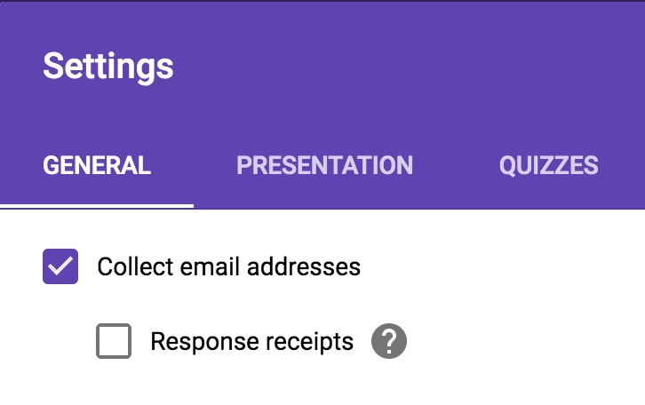
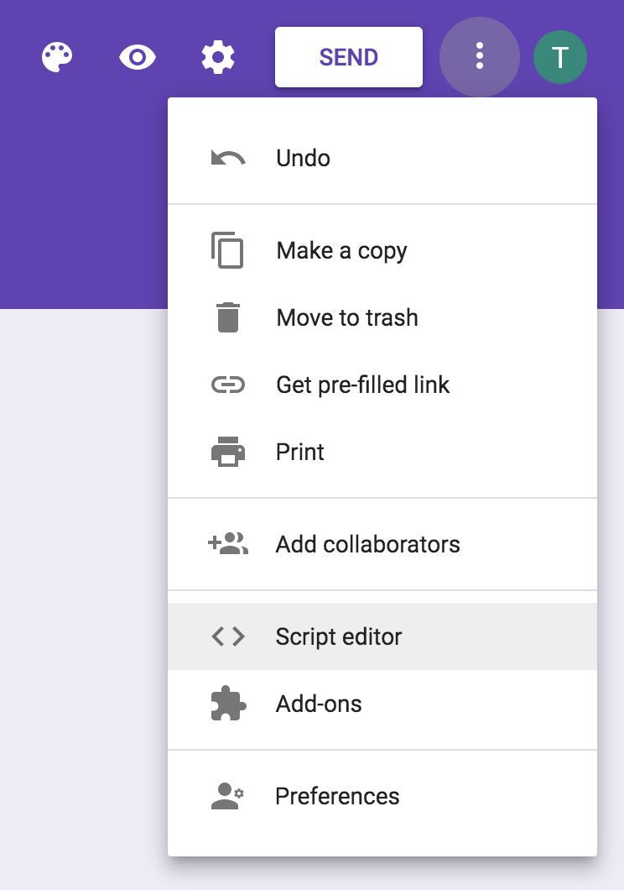
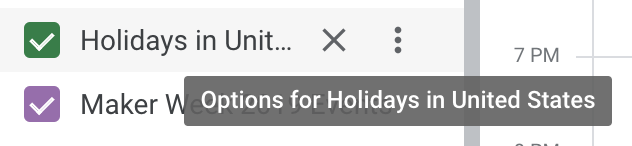
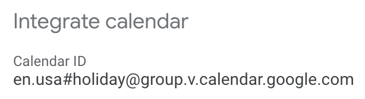
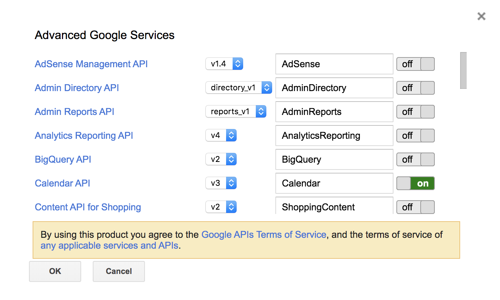
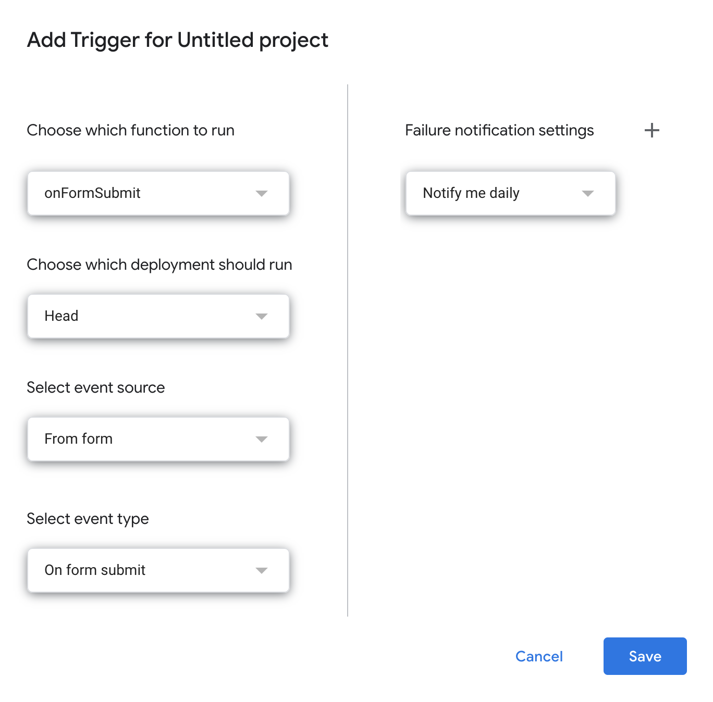

# Google Calendar Auto-Invite

Use this guide to set up a Google Form that automatically sends out Calendar invites when the form is submitted.

Things to note before you proceed:
- While different accounts can create the Form, Calendar event, and App Script, one account needs access to all three in order to properly authorize the script.
- That account needs access to edit the form and to invite others to the event.
- The account that sets up the App Script (which may or may not be the original creator of the form or event) will be the sender of the invites.

## Set up the form

When creating the Google Form, you must **check "Collect email addresses."**

This will add a generated email field to your form. We need to use this generated field (and _not_, say, your custom email field) so that the script can pick up respondents' email addresses. Feel free to customize any other settings and fields.

## Set up the script

From your Google Form, open the hamburger menu and click "Script editor." This will open a new window where you can:

1. Name your project.

1. Paste in one of the sample scripts in this repo.

    - Use [script-invite-all.gs](script-invite-all.gs) if you want to send an invitation to anyone who fills out your form.

    - Use [script-with-capacity.gs](script-with-capacity.gs) if you want to send an invitation to a limited number of submissions and close the form once that number is reached.

1. Update the script with your calendar and event IDs.

    1. To locate the ID of the calendar that has access to add attendees, hover over your calendar name and expand the hamburger menu, then go to  "Settings and sharing."

        

        Go to the "Integrate calendar" section. The calendar ID will look like an email address.

        

        Replace `<YOUR_CALENDAR_ID>` on line 1 with your calendar ID.

    1. Edit the event to find its ID, which is the last part of the URL.

        For example, if the URL is `https://calendar.google.com/calendar/r/eventedit/Nzl0NXRvYXEzc2Q3cjNhaWhsMG4wcWNzN2ggdGh1`, its ID is `Nzl0NXRvYXEzc2Q3cjNhaWhsMG4wcWNzN2ggdGh1`.

        Replace `<YOUR_EVENT_ID>` on line 2 with your event ID.

    1. (Optional) If using [script-with-capacity.gs](script-with-capacity.gs) to cap the number of people invited to the event, update line 3 with the maximum number of form submissions/attendees desired.

    1. Save the script.

1. Enable the Advanced Calendar API in order to allow Google Calendar to send invitations.

    1. Go to _Resources > Advanced Google services_.

    1. Toggle the Calendar API to `on`.

        

    1. Click "OK."

1. Set up the trigger to run the script when the form is submitted.

    1. Go to _Edit > Current project's triggers_.

    1. Click the "Add Trigger" button in the bottom right corner.

    1. Change "Select event type" to "On form submit."

        

    1. Click "Save."

    1. When prompted for authorization, select your account and click "Allow" to grant access to your form and calendar.

## Test

View your form and test it. Note that you won't get a calendar invite if you use the same email address as the owner of the calendar invite, or if the address is already on the invite.
